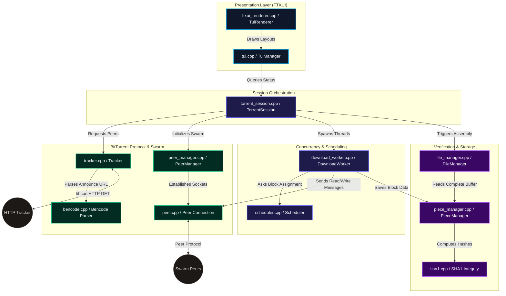

# PeerPressure

A multi-threaded C++ BitTorrent client implementing core protocols, thread-safe block scheduling, file reconstruction, and a terminal dashboard.

---

## Project Overview

**PeerPressure** is a terminal-based BitTorrent client written in C++17. The client manages peer connection pools, schedules concurrent block-level requests, verifies data integrity via SHA-1, and reconstructs file directory structures onto disk. The user interface is driven by the FTXUI library, presenting real-time transfer stats and worker thread states.

## Screenshots

### 1. Splash Screen

The application starts with a splash screen highlighting the major components implemented in the client.


### 2. Torrent Selection

Users can select any `.torrent` file from the configured torrent directory before starting a download session.


### 3. Real-Time Dashboard

The dashboard visualizes swarm statistics, worker activity, scheduler decisions, piece lifecycle, download speed history, and protocol events in real time.


### 4. Completion Screen

Once all pieces are downloaded, verified, and reconstructed, a completion screen summarizes the download session.


### Features
*   **Interactive TUI:** Console dashboard displaying total progress, transfer rates, swarm availability, active worker thread states, and log messages. Includes an interactive file selector on startup.
*   **Multi-threaded Engine:** Spawns worker threads to handle concurrent TCP socket connections and protocol logic with swarm peers.
*   **Protocol Implementation:** Implements standard peer wire communication including handshakes, choke/unchoke states, interest signaling, bitfields, and block requests.
*   **Download Scheduler:** Allocates block requests to active threads, tracks piece availability across the swarm, and handles transfer timeouts and request retries.
*   **Integrity Verification:** Computes SHA-1 hashes of completed pieces to verify integrity against the torrent metadata.
*   **File Reconstruction:** Decodes single and multi-file torrent layouts to write and assemble downloaded data blocks to the correct directories on disk.
*   **Dependency Management:** Resolves and links `FTXUI` and `libcurl` statically via CMake `FetchContent`.

---

## Implemented Protocol Features

*   **Bencode Decoder & Encoder:** Custom recursive parser for bencoded dictionaries, lists, integers, and byte-strings.
*   **Tracker Client:** Formulates HTTP/HTTPS announce requests using `libcurl` and decodes compact peer lists.
*   **Peer Protocol Engine:** Implements the TCP wire protocol (handshake, keep-alive, choke, unchoke, interested, uninterested, have, bitfield, request, piece, cancel).
*   **Piece Verification:** Compares computed 20-byte SHA-1 hashes of assembled pieces against the target hashes from the `.torrent` file.
*   **Concurrency & Scheduling:** Schedules block requests concurrently using thread pools. Uses availability mapping to distribute requests and handles timeouts for block transfers.
*   **File Reconstruction:** Resolves the multi-file directory structure layout, verifying file sizes and writing output data stream sequentially.
*   **TUI Dashboard:** Implements console UI using FTXUI to display active threads, logging messages, and transfer speeds.

---

## Architecture & Component Layers

The client uses a layered design separating presentation, session orchestration, concurrency scheduling, core protocol execution, and verification:



### Component Breakdown

| Layer | Component / Files | Role & Description |
| :--- | :--- | :--- |
| **Presentation** | `tui.cpp` & `ftxui_renderer.cpp` | Renders the terminal dashboard. Displays transfer speed, piece progress, active thread state, and log events. |
| **Session** | `torrent_session.cpp` | Coordinates session lifecycle, manages worker thread pools, and triggers file assembly. |
| **Scheduling** | `scheduler.cpp` & `download_worker.cpp` | Scheduler tracks piece states and maps block assignments. Workers run the peer download loop in dedicated threads. |
| **Protocol** | `tracker.cpp` & `peer.cpp` & `peer_manager.cpp` | Manages HTTP announces, TCP socket connections, compact peer list parsing, and peer protocol messages. |
| **Serialization**| `bencode.cpp` | Decodes and serializes Bencoded types. |
| **Storage** | `piece_manager.cpp` & `file_manager.cpp` | PieceManager manages active download buffers and piece boundaries. FileManager writes files and nested folders to disk. |
| **Integrity** | `sha1.cpp` & `sha1.hpp` | Calculates SHA-1 checksums for piece verification. |

---

## How to Build and Run

### Prerequisites
*   A C++17-compliant compiler (GCC 9+, Clang 10+, or MSVC 2019+).
*   CMake 3.15 or higher.
*   *Windows:* Winsock (`ws2_32`) library (used natively).
*   *Linux/macOS:* Make sure standard build tools are installed. Dependencies are fetched and compiled automatically via CMake.

### Compilation

```bash
# Configure the build directory
cmake -B build -DCMAKE_BUILD_TYPE=Release

# Build the binary
cmake --build build --config Release
```

### Execution

Run the compiled executable.

**On Windows:**
```powershell
.\build\Release\torrent.exe
```

**On Linux / macOS:**
```bash
./build/torrent
```

On launch, the client starts an interactive file selector to select a `.torrent` file from the current directory.

---

## Testing with `test2.torrent`

A test torrent is tracked in this repository to verify download capabilities.

*   **Torrent Name:** `test_folder`
*   **Total Size:** ~19 MB
*   **Structure:**
    ```text
    test_folder/
    ├── images/
    │   ├── LOC_Main_Reading_Room_Highsmith.jpg (Library of Congress)
    │   └── melk-abbey-library.jpg (Melk Abbey Library)
    └── README (20 bytes text file)
    ```

When complete, files are written to the `test_folder/` directory in the current working directory of the application.

---

## Future Roadmap

*   **UDP Tracker Support (BEP 15):** Add UDP tracker client protocol support alongside the HTTP client to announce to `udp://` URLs.
*   **Magnet Links (BEP 9 & BEP 10):** Support magnet URI parsing and metadata transfer (`ut_metadata` extension) to retrieve torrent files from peers directly.
*   **Asynchronous Peer Discovery & Connection Pipeline:** Modify the session to launch peer workers immediately upon discovery and query trackers asynchronously during active downloads to expand the connection pool dynamically.
